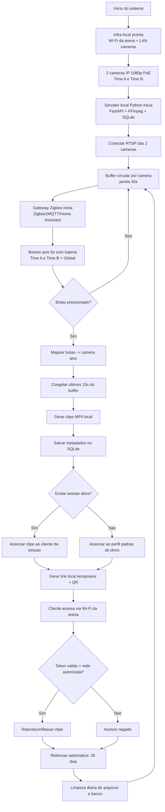
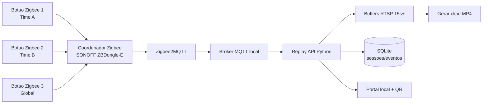

# Diagrama do Projeto - Replay 15s (Local)

## Fluxograma principal (versao atual)

## Desenho logico da central dos botoes (3 botoes)

## Mapeamento dos 3 botoes

- Botao 1 (`time_a`): salva ultimos 15s da `cam_time_a`
- Botao 2 (`time_b`): salva ultimos 15s da `cam_time_b`
- Botao 3 (`global`): salva ultimos 15s de `cam_time_a` e `cam_time_b`

## Politicas definidas

- Sem camera central nesta fase
- Botoes sem fio com bateria (Zigbee)
- Retencao de clips por 30 dias
- Check-in com campos minimos (nome, celular, inicio, fim, quadra)
